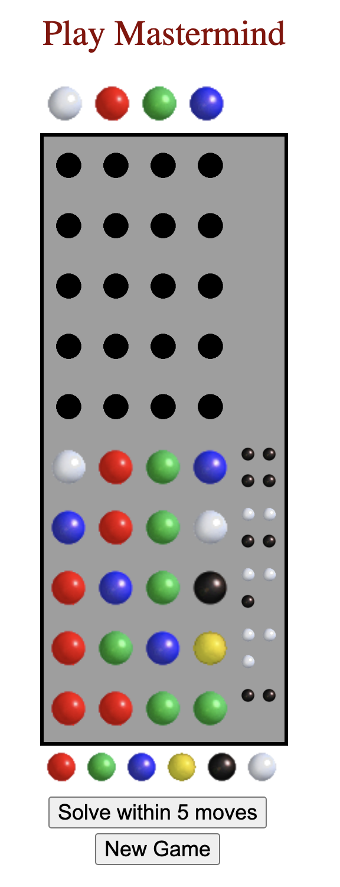

# Mastermind

Play Mastermind [Here](https://ludi317.github.io/)!

Or press the solve button to see the game won in 5 or less moves with Knuth's algorithm described [here](http://www.cs.uni.edu/~wallingf/teaching/cs3530/resources/knuth-mastermind.pdf).

See my [blog](https://medium.com/@ludirehak/latest) for a more thorough background and walkthrough of the code.

## Rules

Guess the right sequence of colors. For each attempt, you will be scored with black or white pegs.

Black means right color, right position for one of the columns.

White means right color, wrong position for one of the columns.

License
-------

-	[MIT License](https://opensource.org/licenses/mit-license.php)
